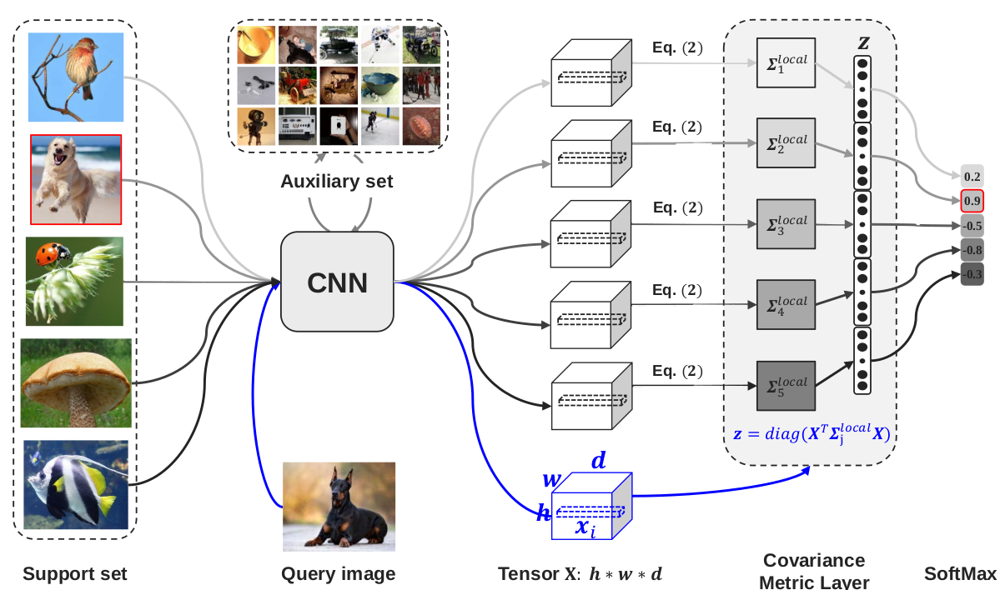
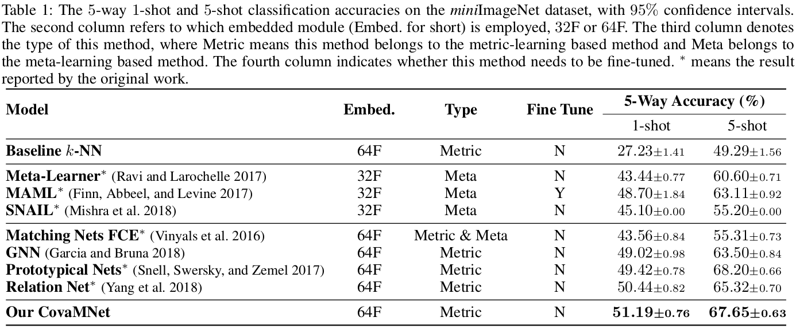
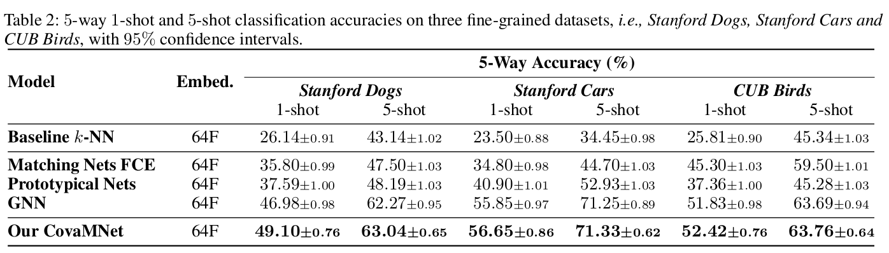

# CovaMNet in PyTorch

We provide a PyTorch implementation of CovaMNet for few-shot learning. The code was written by [Wenbin Li](https://github.com/WenbinLee)<a href="https://cs.nju.edu.cn/liwenbin/"> [Homepage]</a>.<br>

If you use this code for your research, please cite: 

[Distribution Consistency based Covariance Metric Networks for Few-shot Learning](https://cs.nju.edu.cn/rl/people/liwb/AAAI19.pdf).<br> 
[Wenbin Li](https://cs.nju.edu.cn/liwenbin/), Jinglin Xu, Jing Huo, Lei Wang, Yang Gao and Jiebo Luo. In AAAI 2019.<br> 



## Prerequisites
- Linux
- Python 3
- Pytorch 0.4
- GPU + CUDA CuDNN

## Getting Started
### Installation

- Clone this repo:
```bash
git clone https://github.com/WenbinLee/CovaMNet
cd CovaMNet
```

- Install [PyTorch](http://pytorch.org) 0.4 and other dependencies (e.g., torchvision).

### Datasets
- [miniImageNet](https://drive.google.com/file/d/1fUBrpv8iutYwdL4xE1rX_R9ef6tyncX9/view). 
- [StanfordDog](http://vision.stanford.edu/aditya86/ImageNetDogs/).
- [StanfordCar](https://ai.stanford.edu/~jkrause/cars/car_dataset.html).
- [CUB-200](http://www.vision.caltech.edu/visipedia/CUB-200.html). <br>
Thanks [Victor Garcia](https://github.com/vgsatorras/few-shot-gnn) for providing the miniImageNet dataset. In our paper, we just used the CUB-200 dataset. In fact, there is a newer revision of this dataset with more images, see [Caltech-UCSD Birds-200-2011](http://www.vision.caltech.edu/visipedia/CUB-200-2011.html). Note, if you use these datasets, please cite the corresponding papers. 


###  miniImageNet Few-shot Classification
- Train a 5-way 1-shot model:
```bash
python CovaMNet_Train_5way1shot.py --dataset_dir ./datasets/miniImageNet --data_name miniImageNet
```
- Test the model (specify the dataset_dir and data_name first):
```bash
python CovaMNet_Test_5way1shot.py --resume ./results/CovaMNet_miniImageNet_Conv64_5_Way_1_Shot/model_best.pth.tar
```
- The results on the miniImageNet dataset: 



###  Fine-grained Few-shot Classification
- Data prepocessing (e.g., StanfordDog)
 - Specify the path of the dataset and the saving path.
 - Run the preprocessing script.
```bash
#!./dataset/StanfordDog/StanfordDog_prepare_csv.py
python ./dataset/StanfordDog/StanfordDog_prepare_csv.py
```
- Train a 5-way 1-shot model:
```bash
python CovaMNet_Train_5way1shot.py --dataset_dir ./datasets/StanfordDog --data_name StanfordDog
```
- Test the model (specify the dataset_dir and data_name first):
```bash
python CovaMNet_Test_5way1shot.py --resume ./results/CovaMNet_StanfordDog_Conv64_5_Way_1_Shot/model_best.pth.tar
```
- The results on the fine-grained datasets: 



## Citation
If you use this code for your research, please cite our paper.
```
@inproceedings{li2019CovaMNet,
  title={Distribution Consistency based Covariance Metric Networks for Few-shot Learning},
  author={Li, Wenbin and Xu, Jinglin and Huo, Jing and Wang, Lei and Gao Yang and Luo, Jiebo},
  booktitle={AAAI},
  year={2019}
}

```

